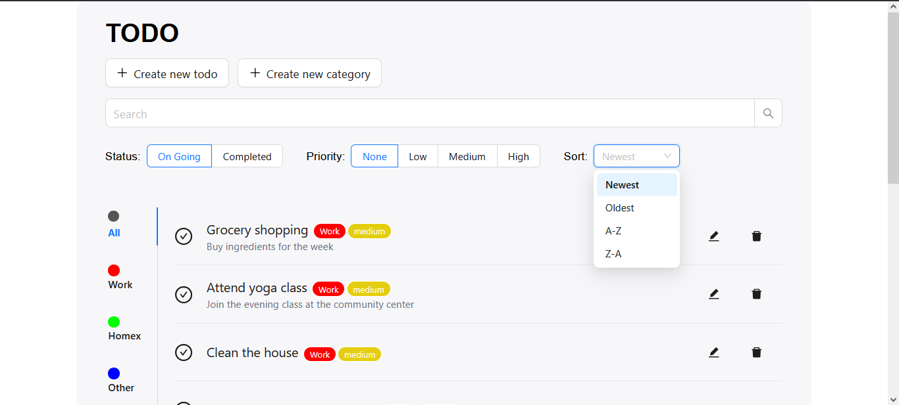
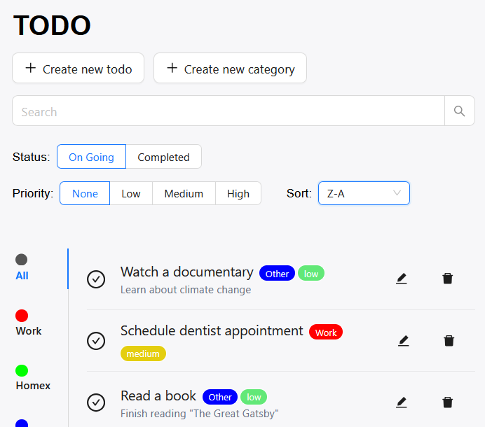
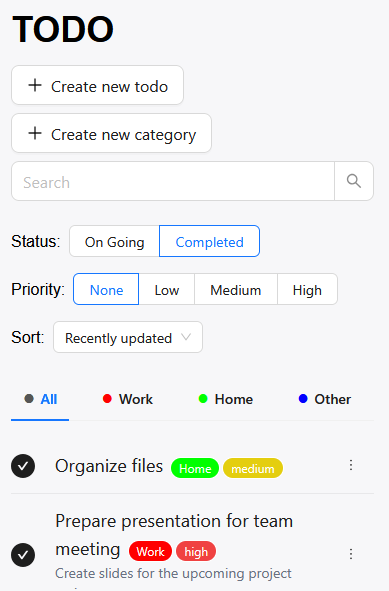

<a id="readme-top"></a>

# Project TODO

A small, minimalistic and fresh fullstack web application that aims to help manage your todos.

<details>
  <summary>Table of contents</summary>
  <ol>
    <li> <a href="#overview">Overview</a></li>
      <ul>
        <li><a href="#main-features">Main features</a></li>
        <li><a href="#built-with">Built with</a></li>
      </ul>
    </li>
    <li>
      <a href="#getting-started">Getting Started</a>
      <ul>
        <li><a href="#prerequisites">Prerequisites</a></li>
        <li><a href="#setup">Setup</a></li>
      </ul>
    </li>
    <li>
    <a href="#technical-questions">Technical Questions</a>
     <ul>
        <li><a href="#database-design">Database design</a></li>
        <li><a href="#technical-decision">Technical decision</a></li>
        <li><a href="#testing-and-quality">Testing and quality</a></li>
      </ul>
    </li>
  </ol>
</details>

## Overview

### Main features

Here are the primary features:

1. Todo management (Fully CRUD)
2. Category management (Fully CRUD)
3. Search (of course debounced)
4. Sorting

State management is context + reducer focused, enforced with TypeScript. A typical dispatch would be: `dispatch({type: "SET_FILTERS", payload: {...filter}})`.

Screenshots:





<p align="right">(<a href="#readme-top">back to top</a>)</p>

### Built with


<p align="right">(<a href="#readme-top">back to top</a>)</p>

## Getting started

### Prerequisites

1. NodeJS
2. Pnpm (preferably) or Npm
3. Postgresql (Make sure the server is running)

### Setup

1. Clone this repository

```sh
git clone https://github.com/daniel-c-j/todo.git
```

2. Open your terminal and `cd` to the root path of the repository, for example:

```sh
cd todo
```

#### BackEnd setup

Let's do backend setup first.

1. Initialization

```sh
cd todo/back-todo
pnpm -i # or npm -i
```

2. Create database based on the config/config.json

```sh
pnpm dlx sequelize-cli db:create # or npx sequelize-cli db:create
```

3. Migrate to create the necessary tables

```sh
pnpm dlx sequelize-cli db:migrate # or npx sequelize-cli db:migrate
```

4. Seed (Optional)

```sh
pnpm dlx sequelize-cli db:seed:all # or npx sequelize-cli db:seed:all
```

5. Run

```sh
pnpm start # or npm run start
```

#### FrontEnd setup

Great, let's move on to the front end.

1. Initialization

```sh
cd todo/front-todo
pnpm -i # or npm -i
```

2. Run

```sh
pnpm dev # or npm run dev
```

<p align="right">(<a href="#readme-top">back to top</a>)</p>

## Technical Questions

### Database design

#### What database tables did you create and why?

a. Describe each table and its purpose

Each table has an id with data type of integer that acts as a primary key that utilize the autoIncrement method.

Todos schema based on sequelize ORM model:

```typescript
id: {
    type: DataTypes.INTEGER,
    autoIncrement: true,
    primaryKey: true,
},
title: {
    type: DataTypes.STRING(255),
    allowNull: false,
},
description: {
    type: DataTypes.TEXT,
    allowNull: true,
},
completed: {
    type: DataTypes.BOOLEAN,
    allowNull: false,
    defaultValue: false,
},
priority: {
    type: DataTypes.ENUM("low", "medium", "high"),
    allowNull: false,
    defaultValue: "medium",
},
due_date: {
    type: DataTypes.DATE,
    allowNull: true, // Should be optional
},
created_at: {
    type: DataTypes.DATE,
    allowNull: false,
    defaultValue: DataTypes.NOW,
},
updated_at: {
    type: DataTypes.DATE,
    allowNull: false,
    defaultValue: DataTypes.NOW,
},
category_id: {
    type: DataTypes.INTEGER,
    allowNull: false,
    references: {
        model: "Categories",
        key: "id",
    },
    onUpdate: "CASCADE",
    onDelete: "CASCADE",
},
```

Categories schema based on sequelize ORM model:

```typescript
id: {
    type: DataTypes.INTEGER,
    autoIncrement: true,
    primaryKey: true,
},
name: {
    type: DataTypes.STRING(30),
    allowNull: false,
},
color: {
    type: DataTypes.STRING(7),
    allowNull: false,
    validate: {
        is: /^#([0-9A-Fa-f]{3}|[0-9A-Fa-f]{6})$/,
    },
},
created_at: {
    type: DataTypes.DATE,
    allowNull: false,
    defaultValue: DataTypes.NOW,
},
updated_at: {
    type: DataTypes.DATE,
    allowNull: false,
    defaultValue: DataTypes.NOW,
},
```

b. Explain the relationships between tables

Each todo record in `Todos` table have a foreign key constraint represented in `category_id` column, which references to table `Categories`'s primary key: `id`

c. Why did you choose this structure?

Simple yet effective for a small project. It might not be future-proof if the project grows to the point where users involved.

#### How did you handle pagination and filtering in the database?

a. What queries did you write for filtering and sorting?

In the GET request for todo, it's like this via sequelize ORM:

```typescript
// Utilizing Math.min and Math.max in order to validate data (e.g can't be decimal)
const page = Math.max(parseInt(req.query.page?.toString() || "1"), 1);
const limit = req.query.limit
  ? Math.min(
      Math.max(parseInt(req.query!.limit!.toString()) || itemsPerPage, 1),
      100
    )
  : itemsPerPage;

let filter: any = {};
if (req.query.title) filter["title"] = { [Op.iLike]: `%${req.query.title}%` };
if (req.query.category_id) filter["category_id"] = req.query.category_id;
if (req.query.priority && req.query.priority !== "none")
  filter["priority"] = req.query.priority;
if (req.query.completed) filter["completed"] = req.query.completed;

const { count, rows } = await Todo.findAndCountAll({
  limit,
  offset: (page - 1) * limit,
  attributes: [
    "id",
    "title",
    "description",
    "completed",
    "created_at",
    "updated_at",
    "priority",
  ],
  order: [
    [
      req.query.sort_by?.toString() || "created_at",
      req.query.sort_order?.toString() || "DESC",
    ],
  ],
  include: [
    {
      model: Category,
      attributes: ["id", "name", "color"],
    },
  ],
  where: filter,
});
```

Raw SQL query demonstration:

```sql
SELECT id, title, description, completed, created_at, updated_at, priority, catg.id, catg.name, catg.color FROM Todos

LEFT JOIN Categories as catg ON Todos.category_id = catg.id

WHERE title ILIKE "%Buy%"

ORDER BY created_at DESC

LIMIT 10 OFFSET 20;
```

b. How do you handle pagination efficiently?

I used a non-auto lazy loading as a more modern approah, basically a list with a `load more` button at the bottom of the items, each time the button is clicked, it will change the `OFFSET` value of the query and bring the new items to be parsed and rendered.

c. What indexes (if any) did you add and why?

No, but planned to index both category name with category color.

<p align="right">(<a href="#readme-top">back to top</a>)</p>

### Technical decision

#### How did you implement responsive design?

a. What breakpoints did you use and why?

Tailwind breakpoints: `sm, md, lg, xl, xxl, 2xl, 3xl, 4xl` and so on.

b. How does the UI adapt on different screen sizes?

Using tailwind breakpoints and considerable flex and inline-blocks. Then constrained with a minimum width of 360px and maximum of `5xl` in tailwind breakpoint.

c. Which Ant Design components helped with responsiveness?

Search bar, inputs, and modal.

#### How did you structure your React components?

a. Explain your component hierarchy

With classic props drilling combined with context, hierarcy would be as such:

```
app
├── header
└── body
    ├── options
    └── tab
        ├── tabheader
        └── tablist
            └── tabitem
```

b. How did you manage state between components?

React Context with Reducer.

c. How did you handle the filtering and pagination state?

By dispatching to the reducer that corresponds to the context.

```typescript
case "SET_FILTERS":
    return { ...state, ...action.payload };
case "SET_PAGE":
    return { ...state, page: action.payload };
case "CLEAR_PAGE_LIMIT":
    return { ...state, page: 1, limit: 10 };
```

#### What backend architecture did you choose and why?

a. How did you organize your API routes?

In Router instances that then be `app.use()` as a middleware for the express engine. So `todoRouter` and `categoryRouter`.

b. How did you structure your code (controllers, services, etc.)?

Models, migrations, seeds, and config at the top most directory, api route related code is stored inside of `src/routes/` with sequelize instance inside of `src/db/index.ts` and express engine initialization at `src/index.ts`

c. What error handling approach did you implement?

Simple dumb centralized middleware.

```typescript
const centralizedError: ErrorRequestHandler = (err, _req, res, _next) => {
  const status = err.status || 500;

  const isOperational = err.isOperational || status < 500;
  if (!isOperational) console.error(err);

  const payload = {
    status,
    message:
      err.message || (status === 500 ? "Internal Server Error" : "Error"),
    ...(NODE_ENV !== "production" ? { stack: err.stack } : {}),
  };

  res.status(status).json(payload);
};
app.use(centralizedError);
```

#### How did you handle data validation?

a. Where do you validate data (frontend, backend, or both)?

More focused on Frontend, not much for backend.

b. What validation rules did you implement?

Classic form input `required`, and typescript inferences.

c. Why did you choose this approach?

For fast deployment, and as for the typescript inference, it's to reduce technical debt when introducing runtime validators in the future such as `zod`.

<p align="right">(<a href="#readme-top">back to top</a>)</p>

### Testing and quality

#### What did you choose to unit test and why?

a. Which functions/methods have tests?

Only the routes, and it's all manually.

b. What edge cases did you consider?

None.

c. How did you structure your tests?

Inside of `tests/http/[routes].http`. Structured based on the HTTP Method.

#### If you had more time, what would you improve or add?

a. What technical debt would you address?

Testing, Validations, UX such as notification feedback, faster todo management, and obviously UI.

b. What features would you add?

Import/export data, backup to cloud, sync, etc.

c. What would you refactor?

Flow of data, enforce more separation of concerns if not more consistencies.

<p align="right">(<a href="#readme-top">back to top</a>)</p>
